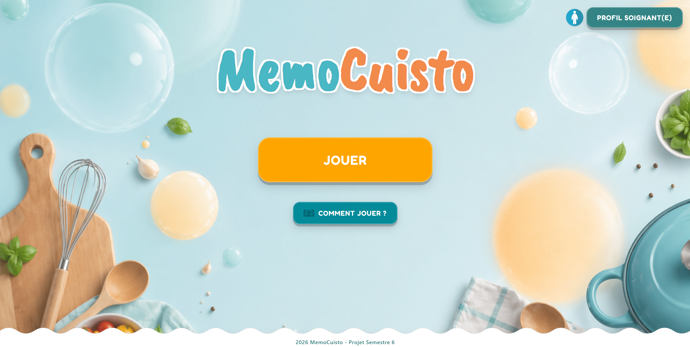

# MémoCuisto — Application de Stimulation Cognitive 🧑‍🍳

**MémoCuisto** est une application interactive destinée aux patients atteints de la maladie d'Alzheimer. À travers des exercices ludiques basés sur l'univers de la cuisine, l'outil sollicite la mémoire et favorise le maintien de l'autonomie. 

Conçue pour être utilisée en autonomie ou en duo avec un aidant familial, l'application transforme le suivi médical en un véritable moment d'échange. Une interface "Espace Soignant" dédiée permet aux professionnels de personnaliser l'accompagnement et de suivre l'évolution du patient.

*Interface principale de l'application permettant d'accéder aux différents modes de jeu et à l'espace soignant.*

---

## Structure du Projet

Le dépôt est organisé de manière claire pour séparer les différents environnements :

* **`frontend/`** : C'est le cœur du jeu. Il contient tout ce qui est visuel et interactif (le code HTML, SCSS et JS).
* **`backend/`** : Le code serveur développé avec Express.js, qui s'occupe de gérer la logique et les données.
* **`ops/`** : L'infrastructure (DevOps). On y trouve nos fichiers Docker (compose.yml et compose-e2e.yml) ainsi que nos scripts d'exécution (run.sh et run-e2e.sh) pour lancer le projet et les tests facilement.
* **`maquette/`** : La maquette basse fidélité (HTML/CSS/JS) réalisée au tout début du projet. Elle nous a permis de faire une démonstration directement aux soignantes pour être certains de bien comprendre leurs vrais besoins.

---

## DevOps & Stratégie de Test

Afin de garantir la fiabilité de l'application, nous avons mis en place une stratégie de tests de bout en bout (E2E) reproduisant le parcours d'un utilisateur réel :

* **Conteneurisation (Docker) :** Le projet est entièrement conteneurisé. Les scripts du dossier ops/ permettent de faire tourner l'application et lancer les tests dans un environnement propre.
* **Scripts d'attente (Healthchecks) :** Utilisation de scripts d'attente (curl) garantissant que les conteneurs Playwright ne se lancent qu'une fois le frontend totalement opérationnel.
* **Tests E2E (Playwright) :** Automatisation des scénarios critiques, notamment :
    * Jouer une partie entière du début à la fin (en Solo ou en Duo) pour s'assurer que rien ne plante.
    * Vérifier que les paramètres et les données d'un patient ne se mélangent pas avec le profil d'un autre.
    * S'assurer que le jeu déclenche bien les aides de manière automatique si le joueur ne touche plus la souris.

---
## Tester le projet localement

Grâce à notre infrastructure Docker, le projet est prêt à l'emploi. Placez-vous dans le dossier `ops/` et lancez le script `./run.sh`. 
L'application sera disponible sur `http://localhost:8080`.

**Accès Espace Soignant :** Pour tester les fonctionnalités de configuration et voir le tableau de bord des statistiques, utilisez le mot de passe par défaut : `1234`.

---

## 👥 Contexte Académique & Équipe

Ce projet a été imaginé et développé en groupe de 4 personnes dans le cadre du module **PS6** suivi en SI3 à **Polytech Nice Sophia**, sous la supervision de l'équipe pédagogique.

*Au sein de cette équipe, j'ai eu un rôle Full-Stack et Ops. J'ai principalement développé l'Espace Soignant (tableau de bord des statistiques et interface de configuration du jeu) ainsi que l'étape interactive du supermarché. Côté infrastructure, j'ai rédigé des Dockerfiles pour la conteneurisation et implémenté plusieurs scénarios de tests E2E automatisés.*